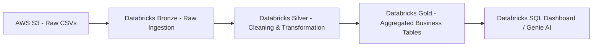
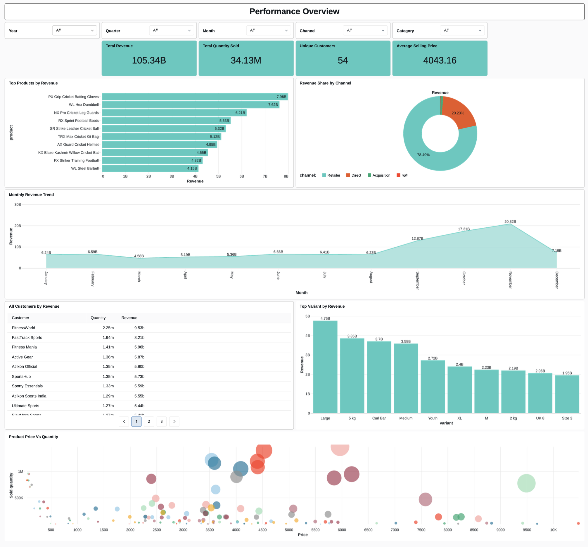

# Atlon & Sports Bar Data Integration Pipeline

## Project Overview
This project demonstrates an end-to-end data engineering solution for **Atlikon**, a sports equipment manufacturer that recently acquired a startup, **Sports Bar**. The primary goal was to resolve data fragmentation and inconsistencies between the two companies. By leveraging **Databricks** and the **Medallion Architecture**, I built a unified data platform that ingests raw data from AWS S3, cleans it through various stages, and provides aggregated analytics for supply chain forecasting and inventory planning.

## Business Use Case
The acquisition of Sports Bar led to "data chaos," where inconsistent metrics and conflicting sales numbers prevented unified business reporting. So company required a reliable data layer to:
- Provide unified aggregated analytics for both companies in a single dashboard.
- Enable accurate supply chain and inventory planning.
- Create a scalable solution that integrates the startup's Excel-based data into Atlon’s enterprise-grade Databricks environment.

## Architecture Diagram

## End-to-End Data Flow
1. **Data Ingestion**: Data is uploaded to an **AWS S3** bucket (Landing zone).
2. **Bronze Layer**: Raw CSV data is ingested into Databricks Delta tables with added metadata (timestamps, filenames) for auditability.
3. **Silver Layer**: Data undergoes rigorous cleaning, including handling nulls, trimming strings, regex-based text corrections, and deduplication.
4. **Gold Layer**: Cleaned data is transformed into a Star Schema (Fact and Dimension tables). Child company data is merged/upserted into the Parent company's tables.
5. **Reporting**: A denormalized view is created to power interactive BI dashboards and AI-driven queries.

## Technology Stack
- **Platform**: Databricks (Community/Free Edition)
- **Cloud Storage**: AWS S3
- **Languages**: PySpark, SQL, Python
- **Architecture**: Medallion Architecture (Bronze, Silver, Gold)
- **Orchestration**: Databricks Workflows (Jobs)
- **Analytics**: Databricks SQL Dashboards & Genie AI

## Data Pipeline Workflow
The pipeline is automated using Databricks Jobs with defined dependencies:
- Task 1: Process Dimension Tables (Customers, Products, Pricing).
- Task 2: Process Fact Tables (Orders) once dimensions are ready.
- Task 3: Perform Monthly Aggregations and Merge operations.
- Task 4: Refresh the denormalized Gold View for BI reporting.

## Data Model / Database Design
The project implements a Star Schema to optimize query performance:
- Fact Tables: fact_orders (Contains transaction details like quantity and dates).
- Dimension Tables: dim_customers, dim_products, dim_gross_price, and a programmatically generated dim_date.

## ETL Process

- Full Load: Initial historical backfill of data from July to November.
- Incremental Load: Daily/Monthly updates processed using a staging area before merging into the production Gold tables.
- Transformations: Used SHA-2 hashing for unique product codes, regex for cleaning protein variant names, and window functions for selecting the latest pricing.

## Dashboard Preview

### Performance Dashboard

📄 Full Dashboard PDF:

[View Full Dashboard](dashboarding/fmcg_dashboard.pdf)

## Key Learnings
- **Medallion Architecture**: Gained practical experience in separating data concerns into Bronze, Silver, and Gold layers for better data quality.
- **Cloud Integration**: Successfully connected Databricks to AWS S3 using External Locations and Storage Credentials.
- **Data Governance**: Implemented schema evolution and audit metadata to track data lineage.
- **Optimization**: Used Upsert (MERGE) operations to handle incremental data without duplicating records.

